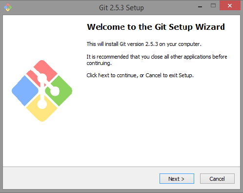
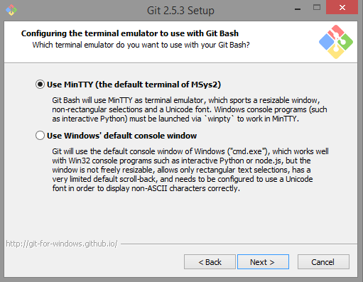
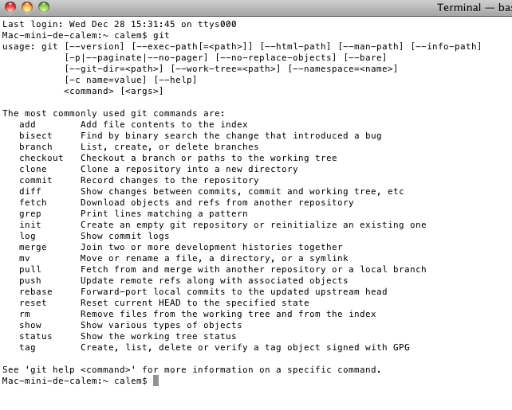

# Capítulo 2: Instalação e Configuração
Jhenifer  
29/10/2015  


## Instalação:

#### Windows
Usuários Windows devem visitar [Git for Windows](https://git-for-windows.github.io/ "Git"), clicar em "Download" e baixar o arquivo ".exe".

Após o download, execute o arquivo e você terá essa tela: 




Como de costume, clice em "Next". Para dar continuidade a instalação aceite a licença do Git.

O diretório apresentado na figura a baixo vem como default, porém é possível alterar a instalação para um diretório de sua preferência. Depois de selecionado o caminho da instalação, clique em "Next" para prosseguir.


Na tela de componentes podemos definir atalhos, integração ao menu de contexto do Windows Explorer, associação de arquivos e uso de font TrueType. O Git Bash é o prompt de comandos próprio, que além dos comandos Git também fornece alguns comandos Unix que podem ser bem úteis. E o Git GUI que é uma interface para trabalhar com Git. É recomendável a seleção de ambos os itens. Depois de selecionado os componentes de sua preferência, dê continuidade.


Aqui, o instalador nos oferece a oportunidade de mudar o nome da pasta no menu iniciar, recomenda-se deixar o padrão para fácil localização posteriormente.


Na tela de configuração "PATH environment", podemos escolher as formas de integração do Git em nosso sistema.  
A primeira opção nos permite usar o Git apenas pelo "Git Bash" (é o prompt de comando do Git), a segunda opção nos possibilita executar os comandos no "Git Bash"" e no prompt de comando do Windows (cmd.exe), e a terceira opção é a junção das duas de cima, porém alguns comandos do Windows serão substituídos por comandos Unix com mesmo nome.  
Essa última opção não é recomendada, portanto a primeira opção é a desejável. 


Abaixo, a configuração de quebra de linha. Windows e sistemas Unix (Linux, Mac) possuem formatos diferentes de quebra de linha em arquivos de texto. Se você escreve um código com quebras de linha no formato Windows, outra pessoa pode ter problemas ao abrir o mesmo arquivo em um Linux, e vice-versa. Esta opção, portanto, permite normalizar isso.  
A primeira opção converte automaticamente os arquivos para padrão Windows quando receber algum arquivo e converterá para padrão Unix quando “comitar” (enviar alterações) no repositório. A segunda opção, não faz nenhuma conversão ao receber arquivos, mas convertem para padrão Unix ao “comitar”. Já a terceira opção, o Git não fará nenhuma conversão.  
Recomenda-se a seleção da opção "Checkout Windows-style, commit Unix-Style line endings".


Aqui, a configuração do emulador de terminal para usar com o Git Bash.  
A primeira opção utiliza o terminal MSys2 (Shell), que permite utilizar comandos Unix no Windows. E a segunda opção, utiliza o terminal padrão do Windows. A melhor opção é a primeira. Feito isso, dê continuidade a instalação.




E por último, configurando ajustes de performance. Essa opção é para habilitar o sistema de cache de arquivo.


Feito isso, “Next”, “Finish” e o Git está instalado.


#### Linux

Em qualquer sistema Linux, pode-se utilizar o gerenciador de pacotes da respectiva distribuição para instalar o Git.
Basta executar o código de instalação de sua respectiva distribuição. 


**Debian**

Em uma sessão de terminal Linux de distribuições Debian (Ubuntu, Mint), execute o código abaixo.  
Adicione o ppa para obter a versão mais recente do Git.

```sh
sudo add-apt-repository ppa:git-core/ppa
sudo apt-get update
```

Agora, execute o comando abaixo para instalação do Git.  
Siga as instruções do prompt de comando, primeiro confirmando a instalação dos pacotes e suas dependências, depois confirmando a instalação do pacote git-core.

```sh
sudo apt-get install git git-core git-man git-gui git-doc \
    ssh openssh-server openssh-client
git --version
```

Para adicionar ferramentas complementares, execute:

```sh
sudo apt-get install gitk meld
```


**Arch**


```sh
pacman -S git openssh meld
git --version
```


**Fedora**


```sh
Yum install git
git --version
```

Usuários de outra versão do Linux dever visitar [Download for Linux](https://git-scm.com/download/linux).


#### MacOS
Exitem duas maneiras de instalar o Git no Mac, uma pelo instalador e outra através do MacPorts.

**Utiizando o Instalador**

O usuário deverá acessar [Download for Mac](http://git-scm.com/downloads), clicar em "Download" e baixar o arquivo ".dmg".

Após o download, é necessário clicar duas vezes para ter acesso ao pacote de instalação. Dentro do arquivo ".dmg", execute o arquivo ".pkg" para iniciar a instalação. 
Siga os passos até concluir a instalação. É recomendável utilizar a instalação padrão. 

Para testar a instalação, abra o terminal e digite o comando “git”. A saída deverá ser similar à imagem:



**Utiizando o MacPorts**

A maneira mais fácil de instalar Git no Mac é via [MacPorts](http://www.macports.org), para isso basta executar o seguinte comando:

```sh
sudo port install git-core
```


## Configurando Perfil
As configurações vão determinar algumas opções globais do Git e é necessário fazê-las apenas uma vez. 

**Usuário**

Os comandos abaixo vão configurar o nome de usuário e endereço de e-mail. Esta informação é importante pois anexa os commits que você realiza, ou seja, as configurações ficarão associadas ao trabalho em desenvolvimento, permitindo que os colaboradores/gestores do projeto identifiquem suas contribuições.

Caso o projeto seja individual, a importância de configurar usuário e e-mail se mantém, uma vez que se trabalha com duas máquinas, é possível a identificação no nome de usuário. 

Em um terminal Bash, execute o código abaixo:

```sh
git config --global user.name "Knight Rider"
git config --global user.email "batman@justiceleague.org"
```

A opção `--global` usará essa informação para todo projeto Git da máquina. 
É possível fazer definições para cada projeto, ou seja, não globais. Para isso é necessário executar o comando a seguir sem a opção `--global`.


```sh
git config user.name "Knight Rider"
git config user.email "batman@justiceleague.org"
```

Uma vez configurado o perfil, o Git está pronto para uso.


**Atalhos**

Os atalhos no Git são chamados de *Alias*. Com ele podemos mapear comandos que repetidamente usamos para algumas poucas teclas. Estes atalhos podem ser criados de dois modos: através do comando no terminal ou editando diretamente no arquivo `/.gitconfig`.

* Pelo terminal:

Execute o comando abaixo com o atalho de sua preferência e o nome completo do camando o qual deseja criar o alias.


```sh
git config --global alias.nome_do_alias "comando inteiro"
```

Um exemplo bem simples é o seguinte:


```sh
git config --global alias.st "status"
```

Assim, ao executar git st é o mesmo que executar git status.

Pelo método citado acima, o alias é adicionado automaticamente no seu arquivo `/.gitconfig`. 

* Pelo arquivo `/.gitconfig`:

Pode-se criar atalhos atravéz de um bloco no seu arquivo de configuração. Para isso, é necessário localizar o diretório do Git e adicionar a lista de comandos desejada, como no exemplo:


```sh
[alias]
  st = status
  ci = commit
  br = branch
  co = checkout
  df = diff
```

Assim que adicionar este bloco com os comandos de sua escolha, ele irá funcionar imediatamente.

Segue abaixo os caminhos para encontrar o arquivo `/.gitconfig` no sistemas operacionais:

+ Windows:  
1 - C:\\Pasta_do_seu_projeto\\.git\\config  
2 – C:\\Documents and Settings\\Seu_usuario\\.gitconfig  
3 – C:\\Arquivos de programas\\Git\\etc\\gitconfig  

+ Mac:  
1 - /Pasta_do_seu_projeto/.git/config  
2 – /Users/Seu_usuario/.gitconfig  
3 – /usr/local/git/etc/gitconfig  
Obs: Os arquivos de configuração do Git não tem extensão.

+ Linux:  
Crie um arquivo como sudo dentro da pasta etc/ com nome de gitconfig e coloque os atalhos de sua escolha.  

Não importa o método você utilize, suas configurações sempre ficarão salvas no arquivo `/.gitconfig`.
