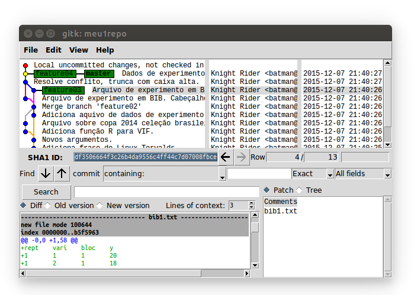
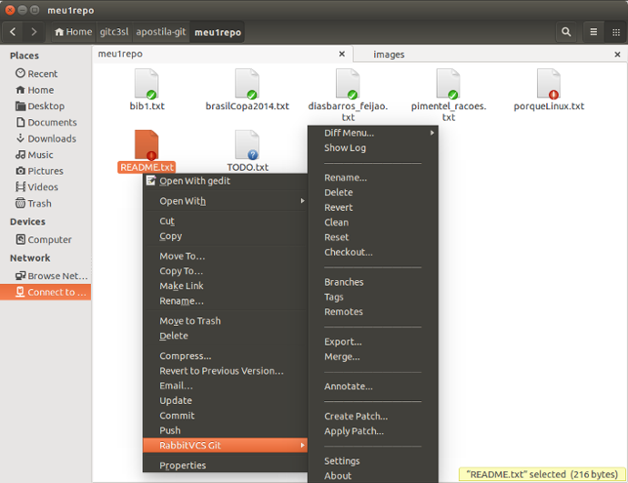
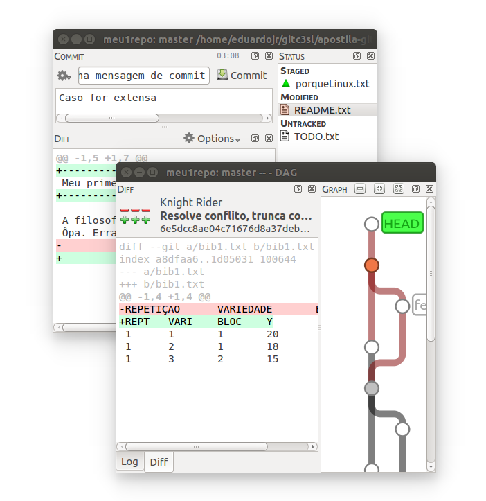

# Ferramentas Gráficas
PET Estatística UFPR  


# Ferramentas gráficas #

No GIT, como vimos até agora, todo o gerenciamento do projeto é
realizado via *CLI (Command line interface)*, linhas de comando
interpretadas, geralmente pelo *bash*. Isso confere um maior controle e
segurança nas ações realizadas, mas em muitas situações os comandos e
*outpus* GIT não se apresentam de forma tão amigável seja pela difícil
memorização ou pela interatividade limitada.

Os comandos mais usuais como `git add`, `git commit` se tornam simples,
pois, mesmo para um usuário iniciante eles fazem parte do cotidiano em
um projeto sob versionamento GIT. Mas algumas situações que não ocorrem
com frequência, como por exemplo voltar a versão de um arquivo ou do
repositório, requerem comandos que são pouco utilizados e para realizá-las 
é necessário a consulta de algum material sobre GIT. Outra situação onde 
a utilização dos comandos é dificultada, ocorre para projetos maiores, onde 
muitos arquivos são alterados simultaneamente e o procedimento de *commit* 
se torna trabalhoso, pois é necessário listar todos os arquivos que fazem 
parte de um *commit* no commando `git add`. Uma última situação exemplo 
em que o uso de *CLI* não parece satisfatório é na comparação de arquivos, 
já usamos o comando `git diff` no capítulo 3 e o *output* deste comando 
foi de simples visualização, mas em arquivos maiores (com muitas linhas) 
a navegação para verificar as alterações do arquivo não é tão amigável. Para
facilitar essas e outras situações surgem as *GUI's (Graphical User 
Interfaces)*, interfaces gráficas para o usuário que incorpora comandos
GIT em *widgets*(botões, caixas de texto etc.) dispostos em uma janela
gráfica de seu sistema operacional.


# Interfaces GIT #

Neste material chamaremos de **Interfaces GIT** as *GUI's* para gestão 
de um repositório. Estas facilitam a utilização das principais 
instruções **GIT** (`git add`, `git commit`, `git push`, `git pull`), 
visualização dos arquivos e alterações no repositório.

Desde o surgimento do GIT diversas *GUI's* foram propostas. Neste 
capítulo apresentamos as principais *GUI's* em diferentes plataformas nos 
sistemas UNIX, Mac OS X e Windows. Detalhes de download, instalação e 
exemplos da utilização destas interfaces no fluxo de trabalho de um 
projeto com versionamento **GIT** são descritos.

## git-gui ##

Baseada em *Tcl/Tk* a *GUI* chamada `git gui` é mantida como projeto
independente do GIT, mas as versões estáveis são distribuídas junto com
o programa principal, portanto não é necessário o download e
instalação. A interface é voltada para realizar alterações no
repositório, desde as mais simples como *commitar* arquivos até as mais 
específicas como voltar estágios ou reescrever o último *commit* (muito 
útil quando notamos erros de gramática logo após a submissão). Nesta 
seção abordaremos apenas as alterações mais comuns no repositório.

`git gui`, no Windows, pode ser aberto pelo menu iniciar. Nesta
plataforma, ao instalar o GIT (conforme visto no capítulo 2) duas
aplicações ficam disponíveis **git BASH** e **git GUI**. Em sistemas
LINUX podemos criar um *alias* (criar e editar adequadamente um
arquivo em */usr/share/applications*) para que a `git gui` fique listada
junto as aplicações do sistema. --Descobrir no MAC se `git gui` fica no
lançador automaticamente. Porém, de forma geral, independente da
plataforma de trabalho, a `git gui` pode ser iniciada a partir de um
terminal `bash`, com o comando:

```sh
git gui
```

Para exemplificar a utilização desta interface vamos alterar alguns
arquivos do repositório `meu1repo`, criado no capítulo 3.


```bash
cd meu1repo/

echo $(tr '[[:lower:][:upper:]]' '[[:upper:][:lower:]]' < README) > README

echo "Lista de afazeres:
-------------------------------------------
* tarefa 1
* tarefa 2
* tarefa 3
* tarefa 4
* tarefa 5
* tarefa 6" > TODO.txt

echo "
Mais um arquivo criado" > OTHER.txt
```

Após as alterações a interface gráfica é chamada.

  
FIGURA: Inteface `git gui`

A interface `git gui` se apresenta de forma simples, o que facilita
sua utilização. Na figura ?? detacamos as quatro áreas que compreendem a
interface. Na primeira porção temos listados os arquivos presentes no
*working directory*, os arquivos criados aparecem com ícone em branco e
os modificados com linhas em azul, aqui a interface implementa
interativamente o comando `git add`, pois ao clicar no ícone de um
arquivo ele é automaticamente adicionado à *staging area*. Na segunda
parte são listados os arquivos na *staging area* com ícone de *check
mark*. Na terceira parte temos a implementação do comando
`git diff` para qualquer arquivo selecionado. Com destaque de cores, a
interface apresenta em vermelho as deleções e em verde as adições. Por fim
temos no canto inferior direito a área para escrever *commits* com
botões para submissão de ação. Um detalhe importante do `git gui` é que
o idioma do sistema operacional é verificado para sua construção, ou
seja, os botões da interface na figura ?? são *push*, *commit*, *sign
off*, etc pois o idioma do sistema operacional em que essa interface foi
executada é o inglês. Para português (Brasil) as mensagens ficam .....

Além das quatro áreas principais da interface, que facilitam
interativamente atividades como `git status`, `git diff`, `git add`,
`git commit` e `git push`, temos mais implementações no menu da
interface para procedimentos não cotidianos. Essas implementações podem
ser acessadas com um simples clique e são auto-explicativas.

## gitk ##

Pioneira dentre as interfaces gráficas, `gitk` foi a primeira
*GUI* implementada. Também implementada em *Tcl/Tk*, esta *GUI*
tem como objetivo a apresentação do histórico de um projeto. A `gitk`
é incorporada ao principal repositório do GIT, portanto nas instalações
completas do GIT esta interface fica disponível sem ser necessário
download e instalação. Nesta seção apresentamos a `gitk` detalhando a
disposição dos elementos nesta interface que se mostra muito útil na
visualização de projetos GIT.

A `gitk` trabalha em conjunto com a `git gui`. Em `git gui` podemos fazer
alterações de forma rápida e visual nos arquivos que estão na *staging
area* e *working directory*, porém para visualizar o histórico completo
de *commits* com ramificações, marcações e demais detalhes, recorremos
à `gitk`. Essa interface se mostra muito útil também como ferramenta de
aprendizagem GIT, uma vez que visualizar de forma gráfica as alterações
que os comandos realizados causam no projeto, torna mais fácil a
compreensão dos mesmos.

`gitk`, assim como a `git gui` pode ser chamada atráves de linha de
comando:

```sh
gitk
```

Para exemplificar a disposição dos elementos nesta interface, seguimos
com as alterações feitas na seção anterior, lembrando que temos todas as
alterações já realizadas no capítulo 3 e ainda duas modificações e uma
inclusão de arquivos não *commitadas*. Visualizando a interface `gitk`
chamada neste estado do repositório temos:

  
FIGURA: Inteface `gitk`

Perceba na figura ?? que esta interface é bem mais completa do que a `git
gui` no que diz respeito à informação. Dividida em apenas duas partes, a
`gitk` apresenta na primeira todo o histórico do projeto, é uma
implementação visual e agradável do comando `git log --graph`. No
gráfico apresentado na parte superior, as bolinhas azuis representam 
*commits* passados, a de amarelo indica o estado atual do repositório e 
em vermelho são asmodificações no *working directory*. Ao lado estão os 
autores dos respectivos *commits* e o momento em que foram feitos. Na parte
inferior da interface temos o detalhamento do *commit* selecionado
na parte superior. As informações contidas aqui vão desde o
identificador do *commit* (*SHA1 ID*), diferença das modificações
referenciadas por este *commit* com relação ao estado anterior do
repositório até a listagem dos arquivos atingidos pelo *commit*
selecionado.

Além da excelente apresentação visual do repositório GIT, a interface 
`gitk` também permite algumas alterações. Clicando com o botão direito de 
seu *mouse* em qualquer *commit* listado podemos criar *tags*, reverter o 
repositório neste estado, criar um ramo a partir do *commit* dentre outras 
opções possíveis atráves da interface.

`gitk` é uma implementação em *Tcl/Tk* para visualização de repositórios
GIT. Com o mesmo objetivo outras interfaces gráficas foram
implementadas.


Podemos destacar duas delas pela grande similaridade à
`gitk`, são elas `gitg` e `gitx`. Ambas podem ser instalar em:

* https://git-scm.com/docs/gitk
* https://lostechies.com/joshuaflanagan/2010/09/03/use-gitk-to-understand-git/

## Outras Interfaces ##

### gitg e gitx ###

Estas duas interfaces tentam juntar em uma única as opções proporcionadas 
pela `git gui` e pela `gitk`. Os layouts e as propostas são similares, a 
diferença está na portabilidade.
A `gitg` é implementada em *GTk+* e está disponível para sistemas LINUX e a
`gitx` foi implementada para Mac OS seguindo o estilo de aplicativos
deste sistema operacional. De forma geral não há detalhes a serem
repassados sobre estas interfaces uma vez que as possibilidades já foram
listadas nas seções sobre `git gui` e `gitk`


FIGURA: Interface `gitg`


FIGURA: Interface `gitx`

### RabbitVCS ###

*RabbitVCS* é uma coleção de ferramentas gráficas para navegadores de
 arquivos do sistema LINUX que permitem o acesso simples e direto aos
 sistemas de controle de versão GIT e/ou Subversion. Não se caracteriza
 como interface, porém altera a visualização no navegador de arquivos de
 diretórios sob versionamento GIT além de dispor de ações implementadas
 nas opções do menu quando pressionado o botão direito do mouse.


FIGURA: Navegador *Nautilus* com uso do `RabbitVCS`

Na figura ?? temos o *screenshot* do repositório `meu1repo` no navegor
de arquivos `nautilus` (padrão do sistema Ubuntu 14.04). Perceba que com
essa interface os ícones de arquivos e pastas no navegador ganham
destaque com um outro pequeno ícone na paste inferior. Estes pequenos
ícones indicam o estado do arquivo sem precisar recorrer ao terminal, ou
seja, temos um `git status` no próprio navegador de arquivos. Além disso
`RabbitVCS` complementa o menu de opções acessados com o botão direito
do mouse. As opções implementadas neste menu são completas, vão
desde *commits*, criação de *branchs* e *tags* até a ações de
reverter o estado do repositório.
 
### git-cola ###

Esta também é uma interface alternativa que se destaca por ser completa
e pela portabilidade (disponível para sistema LINUX, Windows e
Mac). Implementada em *python*, `git-cola` é uma alternativa à `git gui`
e contém praticamente os mesmos elementos para alterações no
repositório. Como a `git gui` se auxilia da `gitk` para visualização,
a `git-cola` também tem uma interface de apoio, chamada de `git-dag` que
vem instalado junto ao `git-cola`.


FIGURA: Interface `git-cola` e `git-dag`

Perceba pela figura ?? que as opções das interfaces são similares
as apresentadas em `git gui` e `gitk`. As interfaces `git-cola` e
`git-dag` se destacam pela fácil manipulação do layout exibido, além de
buscar deixar a interface mais intuitiva possível. Como destaque em
implementação de funcionalidade GIT, a `git-cola` se sobressai com relação
à `git gui` na possibilidade de execução do comando `git rebase` via
interface. 

### Plugins e extensões para editores ###

Muitas vezes é inconveniente trabalhar com códigos fonte em um editor e
ter que abrir um terminal *bash* em outra janela do sistema operacional
para verificar o sistema de versionamento, realizar commits,
etc. Felizmente alguns editores possuem um sistema **GIT** integrado,
seja por meio de *plugins* adicionais instalados ou pela opção nativa do
editor.

Destacamos aqui dois editores, comumente utilizados pela comunidade
estatística, que possuem os comandos **GIT** intergrado à sua
interface. São eles, o `emacs`, o qual temos as opções de *buffers* nos
editores onde podemos abrir uma instância *shell* e executar os comandos
**GIT** junto com o desenvolvimento do código fonte. Além disso uma
extensão poderosa chamada `magit`[^magit] está disponível e em 
desenvolvimento para o **GIT** no `emacs`, esta extensão proporciona 
opções de comandos e visualização em um *buffer* do editor que facilita 
o trabalho de versionamento. Outro editor também muito utilizado em 
Estatística, talvez o mais utilizado pela comunidade, é o RStudio que 
também implementa em sua interface vários comandos, assim como as 
interfaces anteriormente descritas e para tarefas não triviais uma 
chamada do terminal *Shell* é possível dentro do aplicativo. As diversas 
ferramentas do editor RStudio serão exploradas no capítulo ??, com 
exemplos e ilustrações voltadas para a comunidade estatística.

# Interfaces de comparação #

Uma das principais vantagens do **GIT** é a possibilidade de trabalho
paralelo por dois ou mais usuários ou por ramos de desenvolvimento. E
como qualquer desenvolvimento paralelo, desejamos ao final do trabalho, 
mesclar as contribuições realizadas lado a lado. Como vimos no capítulo 
3 isso é feito através do comando `git merge ramo_desenvolvimento` para ramos 
locais e com o comando `git push origin` quando estamos trabalhando em 
equipe e as contribuições são enviadas para um servidor remoto, capítulo 
4. Porém, quando a mesma porção de um mesmo arquivo é alterada em duas 
instâncias distintas (ramos diferentes, usuários diferentes etc.) ocorrem
conflitos e vimos como o **GIT** os sinaliza para que possamos resolvê-los. 
Nesta seção mostraremos as interfaces gráficas dedicadas à resolução de 
conflitos no mesclagem e a visualização da diferença de arquivos em 
estados diferentes do repositório.

## Ferramentas de Comparação Padrão ##

* meld
  + Download e Instalação
  + Utilização básica
  + Utilização no **GIT** como `difftool` e/ou `mergetool`
  + screenshots

* kdiff3
  + Download e Instalação
  + Utilização básica
  + Utilização no **GIT** como `difftool` e/ou `mergetool`
  + screenshots

## Outras interfaces ##

* P4Merge

Citar materiais de referência para instalação e
utilização.

<!-- Exclui o repositório criado para exemplicação -->


[^magit]: http://magit.vc/
