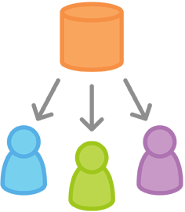
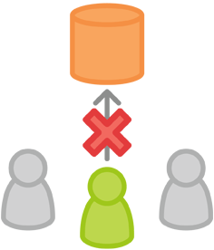
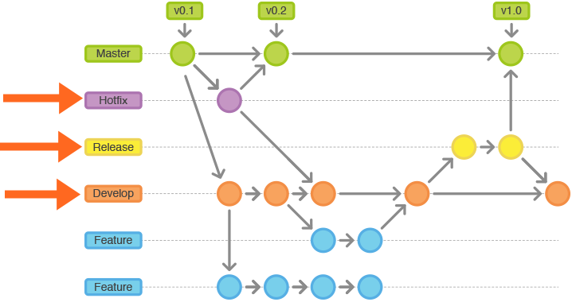

# Capítulo 7: Trabalhando em equipe
PET-Estatística UFPR  

O Git é uma ferramenta que aliada a outros serviços web, como GitLab ou 
GitHub, oferece funcionalidade e autonomia para se trabalhar. 
Contudo, com tantos recursos disponíveis, só serão bem aplicados quando 
todos os membros do grupo, além de conhecê-los, trabalham em harmonia.

## 1.Boas práticas de colaboração

Repositório é onde são armazenados os arquivos de um projeto. Existem 
três níveis de acesso permitidos:

- **Private**: é o repositório fechado, onde apenas o criador (Owner) tem 
permissão de leitura e escrita. Se um repositório privado for criado 
dentro de um grupo, todos do grupo terão permissão de leitura e escrita.


- **Internal**: é o repositório é fechado para usuários externos ao
grupo, mas qualquer usuário cadastrado no grupo terá permissão de leitura
e escrita no repositório.


- **Public**: é o repositório é aberto para qualquer pessoa, e fica
visível para qualquer um (usuário do grupo ou não). Usuários do grupo
tem permissão de leitura e escrita no repositório. Usuários sem conta 
no grupo podem clonar o repositório, mas não tem permissão para alterar 
o repositório (enviar merge requests por exemplo).

É possível adicionar usuários para colaborar em um repositório. Cada 
usuário pode ter um nível de acesso diferente: **Guest**, **Reporter**,
**Developer**, **Master**. Em <a href="https://gitlab.c3sl.ufpr.br/help/permissions/permissions">
permissões</a> é possível visualizar as habilidades concedidas para cada 
nível.

Logo após criar um novo repositório, é recomendável que se crie um arquivo
`README.md`. Independente da forma como o repositório foi configurado, 
é sempre fundamental que ele contenha o arquivo `README.md`. 
Este arquivo é sempre o primeiro a ser mostrado na página inicial 
de todo repositório. Por esse motivo, é importante que o `README.md` 
contenha no mínimo:

- Uma descrição geral do projeto;
- Os nomes dos autores do projeto;
- Instruções de instalação, no caso de softwares;
- A licença do projeto (especialmente para projetos públicos), ou uma 
orientação sobre o uso do projeto (permissão, citação, entre outros). 
Opcionalmente pode-se criar um arquivo *LICENSE* com a licença. 
Esse arquivo ficará disponível também em uma aba na página inicial do 
projeto.
- (**Opcional**): um guia de contribuição, se o projeto pretende que 
colaboradores externos colaborem e precisam de algumas orientações básicas
sobre como colaborar. Criando um arquivo `CONTRIBUTING.md` com este guia,
ele será automaticamente colocado em uma aba na página inicial do projeto.
- (**Opcional**): um *changelog* para que sejam registradas as modificações 
realizadas entre uma versão e outra (principalmente para softwares). 
Criando esse arquivo com estas informações, ele aparecerá automaticamente 
em uma aba na página inicial do projeto. 

Outra parte fundamental do git, são os **commits**. Além de salvarem as
alterações realizadas nos arquivos, também são responsáveis por documentar
as alterações feitas por qualquer usuário e em qualquer arquivo.
Os commits agilizam o processo de revisão do projeto, e poderá ajudar
futuros mantenedores do projeto a desvendar o motivo de algum acréscimo
ou modificação no código. Por causa dessas importâncias, uma mensagem bem 
escrita é a melhor forma de se comunicar a alteração para os demais membros 
do grupo e para você mesmo. Essas mensagens também aparecerão no `git log` 
do projeto,por isso é essencial que sejam bem escritas, de forma clara e 
sigam um padrão.

Algumas **regras de ouro**, que são convenções gerais, para que um projeto 
versionado com git seja bem sucedido são:

- **Faça commits regularmente**: isso faz com que as mudanças de código 
entre um commit e outro sejam menores, tornando mais fácil para todos 
acompanhar as alterações;

- **Não faça commits de trabalhos pela metade**: faça um commit apenas 
quando tiver finalizado o que estava propondo. Isso irá forçar você a 
deixar o trabalho em pedaços menores, e por consequência realizar
commits regularmente;

- **Teste antes de fazer um commit**: resista à tentação de fazer um commit 
que você pensa que está completo. Teste toda a sua realização para 
ter certeza de que não causará um efeito colateral no projeto;

- **Escreva boas mensagens de commit**: seja claro e objetivo ao escrever 
as mensagens de commit. No entanto, tome cuidado para não ser vago, ou 
escrever apenas `mudança`, `mais mudanças`, etc. Se uma mensagem curta for suficiente, use `git commit -m 'Mensagem'`, mas lembre-se de ser 
informativo sobre a alteração realizada, para ser útil para todos do 
projeto.

Existem outras convenções estabelecidas sobre como escrever mensagens 
de commit contextualizadas, baseadas nas mensagens geradas por mensagens
de funções do próprio git. Estas convenções podem resumidas nas 7 regras
que são convenções globais:

1.**Separe o título do corpo do texto com uma linha em branco**: por padrão, 
a primeira linha é o título do commit, e deve ser uma mensagem curta. 
Ao deixar uma linha em branco, é permitido escrever uma mensagem de 
qualquer tamanho, detalhando melhor as modificações feitas. 
Dessa forma, quando  `git log` for executado, toda a mensagem de commit
aparecerá, enquanto que `git log --oneline` mostrará apenas o título do 
commit. 

2.**Limite a linha de título em 50 caracteres**: isso faz com que o 
colaborador pense mais para escrever uma mensagem mais informativa.
Se a mensagem for uma única linha (`git commit -m`), então esse limite 
pode se estender para 72 caracteres.

3.**Capitalize a mensagem**: em todas as mensagens de commit comece com 
letra maiúscula, tanto se for título, corpo da mensagem, ou apenas 
uma mensagem de uma única linha.

4.**Não termine os commits com ponto**: principalmente se for o título 
de uma mensagem de commit mais longa. Espaço é valioso quando se temos 
no máximo 50 ou 72 caracteres.

5.**Use o modo imperativo**: no título de commits longos ou em mensagens 
de commits únicas. O modo imperativo significa escrever como se estivesse 
dando um comando a alguém. Seja direto e objetivo, e escreva no presente. 
Exemplos de mensagens no impertativo:
```sh
- Adiciona versão final

- Altera parágrafo da introdução

- Remove funções precipitadas
```

Algumas mensagens no modo **não** imperativo são:
```sh
- Corrigindo o erro

- Mudando a função 

- Mais correções para mais funções
```


6.**Limite o corpo da mensagem em 72 caracteres**: ao escrever uma mensagem 
de commit mais longa, devemos manter o corpo da mensagem com no máximo 
72 carateres.


7.**Use o corpo da mensagem para explicar "o que" e "porque", e não "como"**: contextualize o que você fez e o motivo. Na maioria dos casos você pode 
deixar de fora como você fez as modificações, pois o código alterado já 
deverá ser auto-explicativo. 


## 2.Modelos de fluxos de trabalho

A escolha do *workflow* (fluxo de trabalho) depende de cada projeto e das preferências pessoais. Podemos utilizar as informações sobre cada *workflow*, e decidir qual é mais adequado para cada projeto. Existem quatro maneiras 
principais de trabalhar em colaboração com o git e o GitLab:

- #### **Centralized workflow**: 
recomendado para projetos pequenos, e/ou que não necessitam de muitas 
alterações. Nesse workflow, o repositório possui apenas um brach (`master`) 
e as alterações são feitas nesse branch. As revisões só poderão ser 
realizadas depois que tudo foi enviado para o servidor remoto. Com isso, 
há uma grande chance de ocorrerem conflitos.


      **Exemplo**

      Após iniciar um repositório central, os colaboradores devem clonar
      o repositório.

      

      FIGURA: Colaboradores clonando o repositório central

      Depois de um colaborador terminar seu trabalho remotamente, ele 
      publica as modificações para o repositório central, para que os 
      demais membros possam ter acesso.

      

      FIGURA: Colaborador publicando as modificações no repositório central

      Outro membro também termina seu trabalho e resolve publicar no 
      repositório central, porém não irá conseguir. O repositório central 
      está diferente do seu repositório local.

      

      FIGURA: Colaborador não conseguindo publicar as modificações no 
      repositório central
      
      Para conseguir enviar as modificações realizadas, o colaborador
      precisa puxar as atualizações feitas para  o seu repositório, 
      integrá-los com as suas alterações locais, e em seguida, tentar 
      novamente.
      
      

      FIGURA: Colaborador puxando as modificações do repositório central
      
      Após feito isso, será possível o colaborador fazer as modificações.
      
      

      FIGURA: Colaborador publica modificações do repositório central

- #### **Feature branch workflow**: 
recomendado para projetos pequenos e grandes que envolvam mais de um 
colaborador. O projeto principal é mantido nobranch master. Se um membro 
quiser realizar alguma alteração, deverá criar um novo branch `feature`, 
e fazer as alterações nesse branch e sugerir um `merge request`. Com isso, 
os demais colaboradores poderão revisar as alterações sugeridas e discutir as modificações, até que uma pessoa habilitada faça o merge desse branch 
`freature` para o branch `master`.
Dessa forma, evita-se os possíveis conflitos e garante que tais alterações
não causaram algum problema. Esse workflow é altamente recomendado por
ser simples de gerenciar, evitar grandes conflitos, e ser relativamente 
fácil para usuários novos do git.


      **Exemplo**

      Antes de começar a desenvolver um recurso, é preciso de criar um 
      ramo isolado para trabalhar

      

      FIGURA: Criando um novo ramo para o trabalho

      Com isso, o membro poderá iniciar o seu trabalho, e realizar o que
      for necessário nesse ramo (brach). Após finalizar o projeto, o colaborador
      envia suas modificações, irá requirir um `merge request` para que 
      as alterações feitas nesse branch, sejam incorporadas no `master`. Os 
      demais membros, poderão avaliar se tais modificações são pertinentes
      para o projeto.

      

      FIGURA: Colaborador solicita merge, e aguarda revisão dos demais
      colaboradores

      Quando as alterações sugeridas para o colaborador forem incorporadas
      o branch poderá ser movido para o `master`.

      

      FIGURA: Movendo ramo para o master

- #### **Gitflow workflow**: 
indicado para projetos maiores e/ou com um grande número de colaboradores. 
Esse workflow envolve a criação de alguns branches com funções específicas. 
Todo o desenvolvimento é realizado no branch `develop`. Quando uma versão 
está pronta, ela é movida para o branch `release`, onde é testada e 
finalmente incorporada ao ramo master, que contém apenas versões finais
(estáveis). É extremamente recomendado esse workflow para desenvolvimento 
de softwares, porém exige de mais familiaridade com o git. Permite, por 
exemplo, que os usuários de um software, instalem tanto uma versão estável 
(do branch `master`) quanto uma versão em desenvolvimento 
(do branch `develop`).

      **Exemplo**

      São criados branches com funções específicas, como no exemplo `Hotfix`,
      `Release` e `Develop`.

      

      FIGURA: Ilustração dos branches específicos

      *Develop* é semelhante ao master do feature branch workflow. *Release*
      serve "lançar" possíveis bugs gerados no código. *Hotfix* contém as
      correções dos bugs do release que não podem aguardar o lançamento
      do mesmo.


- #### **Forking workflow**: 
recomendado para projetos abertos, onde se espera usuários externos façam contribuições. Esse workflow consiste de um repositório oficial, de onde 
os colaboradores fazem um `fork` desse repositório, e passam a desenvolver 
o projeto de maneira independente. Assim, cada colaborador poderá adotar 
o workflow de preferência, e não precisará ter acesso ao repositório 
oficial, apenas colaborar enviando `merge`.

      **Exemplo**

      Criado o repositório central, os colaboradores fazem um `fork`
      poderão trabalhar de maneira independente. 

      

      FIGURA: Ilustração dos forks de um projeto

   Independente da escolha do workflow para cada projeto é importante sempre
informar o método que está sendo utilizado para seus colaboradores,
para que eles possam seguir o mesmo padrão. Essas informações poderão ser
descritas em `README.md` ou no `CONTRIBUTING.md`.

## 3.Fluxo de trabalho PET no GitLab

O PET-Estatística UFPR possui um grupo no Git para o desenvolvimento de
projetos. Utilizaremos a seguinte ilustração para entender o fluxo do 
trabalho do PET.

(figura que haverá um dia)

FIGURA: Ilustração do fluxo de trabalho do PET

Conforme a demanda de projetos, é criado o repositório para armazená-lo. 
Após isso, são criados as `milestones` - marcadores de 
classificação dos arquivos. Esses passos são feitos no `Owner`.

Indo para o `master`, temos os seguintes passos:

- Conforme a demanda do projeto, é criado um `issue` para adição de 
contribuições;
- Atualiza o ramo `devel`;
- Após isso, é necessário criar um `branch` (ramo) para incluir as 
contribuições;

Entrando no `developer`, teremos o ciclo de trabalho em que adiciona
as modificações (`git add`), registra as mesmas (`git commit`) e após 
realizar todo o trabalho, é feito o `git push` enviando ao 
servidor remoto.

A próxima etapa é a requisição de `merge`. Com esse `merge`, é feita as 
discussões a respeito da contribuição, assim podendo retornar ao ciclo
do `developer` para as devidas correções e sugestões. 
Após a certeza dessa contribuição, é movida para o ramo `devel` e fechado 
o `issue`referente ao trabalho feito.

Depois de terminar todas etapas do projeto, completa-se as `milestones`,
realiza o `merge` do `devel` no `master`, e cria a tag de versão.


### Referências
https://git-scm.com/book/pt-br/v1/Git-Distribu%C3%ADdo-Contribuindo-Para-Um-Projeto

https://prezi.com/_lm8kozmii8n/git-workflow/ 

https://www.atlassian.com/zh/git/workflows\#!workflow-overview

http://git.leg.ufpr.br/leg/gitlab-rautu/blob/master/CONTRIBUTING.md
